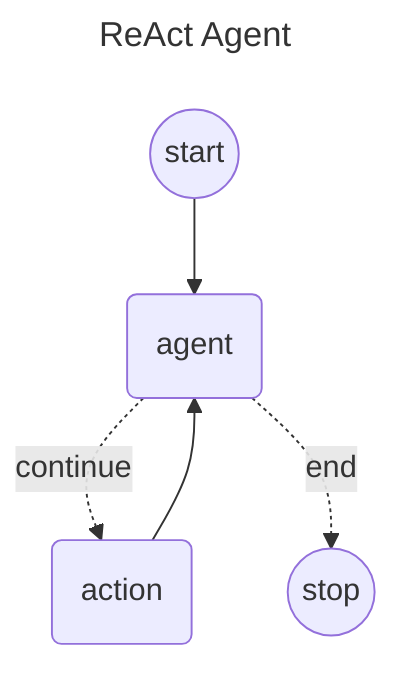

# Langgraph4j and SpringAI AgentExecutor

This is an implementation of ReACT agent in [Spring AI] using Langgraph4j

## Diagram



## Getting Started


```java
@SpringBootApplication
public class SpringAiDemoApplication {
    public static void main(String[] args) {
        SpringApplication.run(SpringAiDemoApplication.class, args);
    }
}
```

### create ChatModel configuration

```java
@Configuration
public class ChatModelConfiguration {

    @Bean
    @Profile("ollama")
    public ChatModel ollamaModel() {
        return  OllamaChatModel.builder()
                .ollamaApi( new OllamaApi( "http://localhost:11434" ) )
                .defaultOptions(OllamaOptions.builder()
                        .model("qwen2.5:7b")
                        .temperature(0.1)
                        .build())
                .build();
    }

    @Bean
    @Profile("openai")
    public ChatModel openaiModel() {
        return OpenAiChatModel.builder()
                .openAiApi(OpenAiApi.builder()
                        .baseUrl("https://api.openai.com")
                        .apiKey(System.getenv("OPENAI_API_KEY"))
                        .build())
                .defaultOptions(OpenAiChatOptions.builder()
                        .model("gpt-4o-mini")
                        .logprobs(false)
                        .temperature(0.1)
                        .build())
                .build();

    }

}
```

### create agent executor and run in a console application

```java
@Controller
public class DemoConsoleController implements CommandLineRunner {
    private static final org.slf4j.Logger log = org.slf4j.LoggerFactory.getLogger(DemoConsoleController.class);

    private final ChatModel chatModel;
    private final List<ToolCallback> tools;

    public DemoConsoleController( ChatModel chatModel, List<ToolCallback> tools) {

        this.chatModel = chatModel;
        this.tools = tools;
    }

    @Override
    public void run(String... args) throws Exception {

        log.info("Welcome to the Spring Boot CLI application!");

        var graph = AgentExecutor.builder()
                        .chatModel(chatModel)
                        .tools(tools)
                        .build();

        var workflow = graph.compile();

        var result = workflow.stream( Map.of( "messages", new UserMessage("what is the result of 234 + 45") ));

        var state = result.stream()
                .peek( s -> System.out.println( s.node() ) )
                .reduce((a, b) -> b)
                .map( NodeOutput::state)
                .orElseThrow();

        log.info( "result: {}", state.lastMessage()
                                    .map(AssistantMessage.class::cast)
                                    .map(AssistantMessage::getText)
                                    .orElseThrow() );
    }
}
```

### Customize Spring AI ChatClient

If you need to customize ChatClient creation you must provide a `AgentExecutor.ChatService` factory to chat executor builder

```java

public class CustomChatService implements AgentExecutor.ChatService {

    final ChatClient chatClient;
    
    CustomChatService( AgentExecutorBuilder<?,?> builder ) {
        // chat client creation logic
    }

    @Override
    public ChatClient chatClient() {
        return chatClient;
    }

}

var graph = AgentExecutor.builder()
                .chatModel(chatModel)
                .tools(tools)
                .build( ( builder ) -> new CustomChatService( builder ) );

```


### BONUS: Create Langgraph4j Studio configuration

```java
@Configuration
public class LangGraphStudioConfiguration extends LangGraphStudioConfig {

    final StateGraph<AgentExecutorEx.State> workflow;

    @Override
    public Map<String, LangGraphStudioServer.Instance> instanceMap() {

        return  Map.of( "sample", LangGraphStudioServer.Instance.builder()
                .title("LangGraph Studio (Spring AI)")
                .addInputStringArg( "messages", true, v -> new UserMessage( Objects.toString(v) ) )
                .graph( workflow )
                .compileConfig( CompileConfig.builder()
                        .checkpointSaver( new MemorySaver() )
                        .releaseThread(true)
                        .build())
                .build());

    }

    public LangGraphStudioConfiguration( /*@Qualifier("ollama")*/ ChatModel chatModel ) throws GraphStateException {

        this.workflow = AgentExecutorEx.builder()
                .chatModel(chatModel, true)
                .toolsFromObject(new TestTools())
                .build();

    }

}

```
[Spring AI]: https://docs.spring.io/spring-ai/reference/index.html